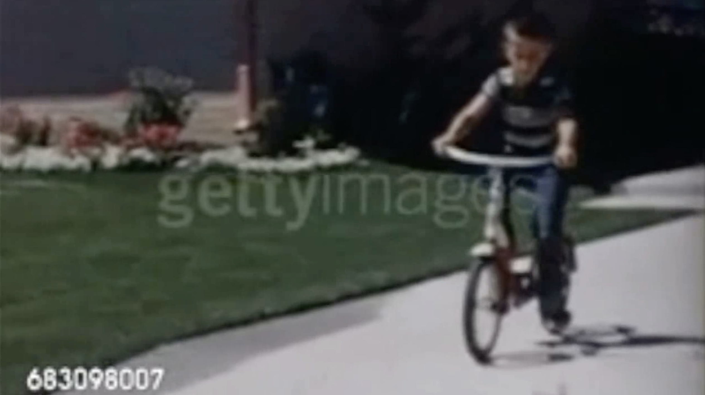
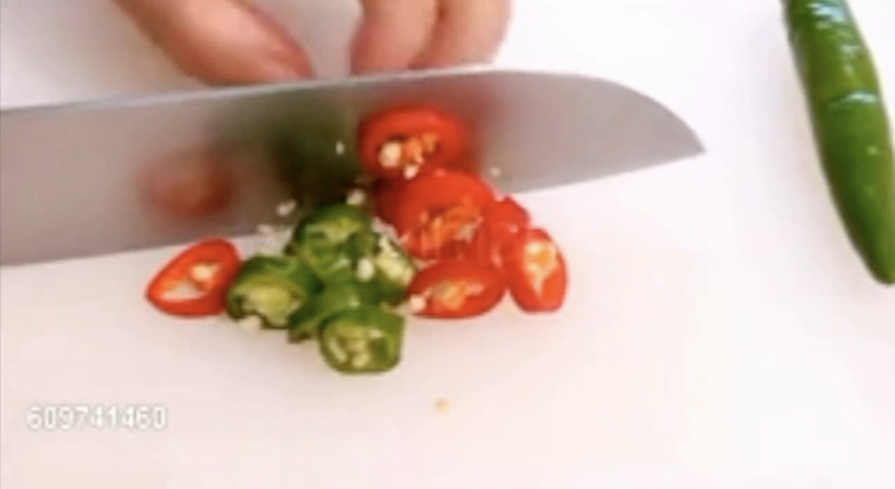
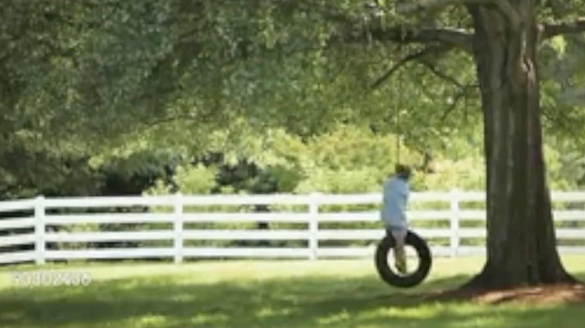

# 🧠 🔄 AoT-PsyPhyBENCH: A psychophysically validated benchmark testing whether vision-language models can infer the arrow of time like humans do.

> **⚠️ Note: This repository is currently under construction. Content and structure may change.**

> 🏆 **Leaderboard coming soon!**

This repository hosts the evaluation code and benchmark data for **AoT-PsyPhyBENCH**: a psychophysically validated benchmark that tests whether VLMs can infer temporal direction in natural videos using the same stimuli and behavioral baselines established for humans.  
It supports local **vLLM** inference, **OpenAI** API models, and **Google Gemini** models (via an OpenAI-compatible endpoint).

## 🔄 What is the Arrow-of-Time (AoT) task?
The task requires a vision-language model (VLM) to determine whether a video clip is playing **forward** or **backward**. Despite its seemingly simple formulation, there is a substantial performance gap between humans and VLMs: even the latest proprietary VLM achieves only around 60% accuracy, whereas humans reach 90.1% on our benchmark.


## 🧪 Benchmark curation

AoT-PsyPhyBENCH follows the motion categories from Hanyu et al. (2023): https://royalsocietypublishing.org/doi/full/10.1098/rsos.230036.  

Human F1 scores are reported as forward (F) / backward (B) for each motion category.

| Category | Description                                                                                   | Reversal easy for humans? | Human F1 (Forward/Backward) | # samples | Included in AoT-PsyPhyBENCH? |
|----------|-----------------------------------------------------------------------------------------------|----------------------------|-----------------------------|----------:|------------------------------|
| (1) Proceed     | forward locomotion of people, animals, or vehicles   <br/><br/>      | ✅                         | 86.5 / 82.5                 | 82       | Yes                          |
| (2) Fall        | free-fall / ballistic motion under gravity <br/><br/>                      | ✅                         | 86.9 / 82.8                 | 84       | Yes                          |
| (3) Diffusion   | centrifugal diffusion or small-particle explosions    <br/><br/>     | ✅                         | 84.6 / 78.7                 | 56       | Yes                          |
| (4) Division    | division of material by hand or tool          <br/><br/>         | ✅                         | 86.0 / 80.6                 | 37       | Yes                          |
| (5) Put         | addition / construction of material by hand        <br/><br/>      | ✅                         | 84.1 / 77.4                 | 67       | Yes                          |
| (6) Reciprocal  | reciprocating (cyclic) motion                       <br/><br/>  | ❌                         | 71.6 / **38.5**             | 148      | No                           |


AoT-PsyPhyBENCH includes categories 1–5 (irreversible processes) and excludes category 6,  
where reversal is typically challenging even for humans.

## 📊 AoT-PsyPhyBENCH dataset download
Please refer to [`neuro_paper_data/neuro_paper_data/README.md`](./neuro_paper_data/neuro_paper_data/README.md)

## Leaderboard

We evaluated the following models on AoT-PsyPhyBENCH:

- 🔒 **Proprietary non-reasoning** — GPT-4o, GPT-4.1

- 🔒🧠 **Proprietary reasoning** — o3, o4-mini, GPT-5, Gemini-2.5-Pro

- 🟢 **Open-weight non-reasoning** — Qwen2-VL, Qwen2.5-VL

- 🟢🧠 **Open-weight reasoning** — Cosmos-Reason1-7B, QVQ-72B-Preview

We evaluate all models across multiple experimental settings, detailed in our paper.

The table below summarizes current zero-shot setting results on AoT-PsyPhyBENCH. All models are evaluated using the official scripts in this repository.
## 🎯 Zero-shot performance

| Family        | Model               | Reasoning?      | F1<br/> Forward | F1<br/>Backward | Acc. |
|---------------|---------------------|-----------------|----------------:|----------------:|-----:|
| Baselines     | Random              | —               |               — |               — | 50.0 |
| Baselines     | Human               | —               |            90.0 |            88.0 | **89.2** |
| Open Models   | Qwen2-VL-7B         | Non-reasoning   |            66.7 |             0.0 | 50.0 |
| Open Models   | Qwen2.5VL-7B        | Non-reasoning   |            63.0 |            19.5 | 49.3 |
| Open Models   | Qwen2.5VL-72B       | Non-reasoning   |            57.4 |            38.2 | 49.5 |
| Open Models   | QVQ-72B-Preview     | Reasoning       |            66.1 |             0.0 | 49.4 |
| Open Models   | cosmos-reason1 7B   | Reasoning       |            31.2 |            63.3 | **52.1** |
| Proprietary   | GPT-4o              | Non-reasoning   |            65.4 |            24.9 | 52.6 |
| Proprietary   | GPT-4.1             | Non-reasoning   |            62.5 |            57.4 | **60.1** |
| Proprietary   | o3                  | Reasoning       |            67.2 |            29.1 | 55.2 |
| Proprietary   | o4-mini             | Reasoning       |            67.4 |            33.1 | 56.1 |
| Proprietary   | GPT-5               | Reasoning       |            68.7 |            26.8 | 56.1 |
| Proprietary   | Gemini-2.5-pro      | Reasoning       |            65.9 |            51.4 | 59.9 |


## Environment
Use **uv** to reconstruct the environment:
```bash
uv sync
```

## Run the Evaluation
The entrypoint scripts are `run_*.sh`. 

1. Replace the API key with yours in the entrypoint script. Adjust the concurrent call number according to your API rate limits. 
2. Check if the video data is correctly placed in the path as written in the entrypoint script. If you haven't prepared the video data, please follow the README in `./neuro_paper_data/neuro_paper_data/README`. 
3. Run the script. 

## 📝 To Do

- [ ] 📓 Notebook with preprocessing + inference pipeline
- [ ] 🏆 Release the official leaderboard website


## 📄 Citation

If you use this benchmark in your research, please cite:
```bibtex
@article{matta2025whichway,
  title={Which Way Does Time Flow? A Psychophysics-Grounded Evaluation for Vision-Language Models},
  author={Matta, Shiho and Kanashiro Pereira, Lis and Han, Peitao and Cheng, Fei and Kitazawa, Shigeru},
  journal={arXiv preprint arXiv:2510.26241},
  year={2025},
  url={https://arxiv.org/abs/2510.26241}
}
```

**Paper:** [Which Way Does Time Flow? A Psychophysics-Grounded Evaluation for Vision-Language Models](https://arxiv.org/abs/2510.26241)
