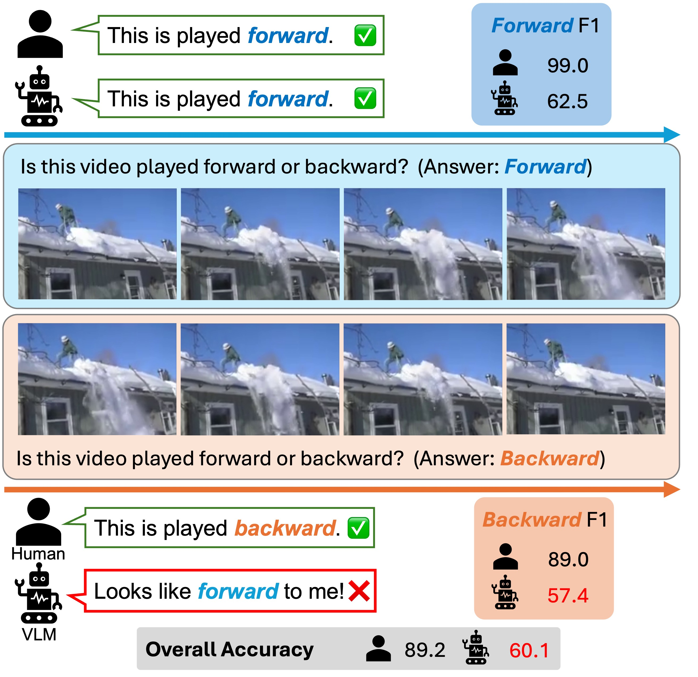

# AoT-PsyPhyBENCH: Evaluation Code and Data

This repository hosts the evaluation code and benchmark data for **AoT-PsyPhyBENCH**.  
It supports local **vLLM** inference, **OpenAI** API models, and **Google Gemini** models (via an OpenAI-compatible endpoint).

## What is the Arrow-of-Time (AoT) task?
The Arrow-of-Time (AoT) task requires a vision-language model (VLM) to determine the playback direction of a video clip (a binary classification problem).
There is a substantial performance gap between humans and VLMs: even the latest proprietary VLM achieves only around 60% accuracy, whereas humans reach 90.1% on our benchmark.



## Environment
Use **uv** to reconstruct the environment:
```bash
uv sync
```

## Run the Evaluation
The entrypoint scripts are `run_*.sh`. 

1. Replace the API key with yours in the entrypoint script. Adjust the concurrent call number according to your API rate limits. 
2. Check if the video data is correctly placed in the path as written in the entrypoint script. If you haven't prepared the video data, please follow the README in `./neuro_paper_data/neuro_paper_data/README`. 
3. Run the script. 